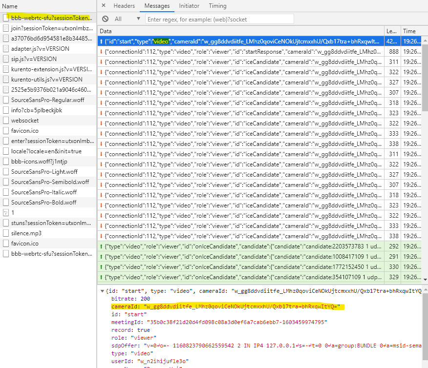
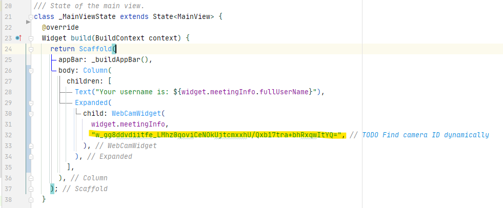

# App for BigBlueButton

This app uses BigBlueButton and is not endorsed or certified by BigBlueButton Inc. BigBlueButton and the BigBlueButton Logo are trademarks of BigBlueButton Inc.

This project is a Flutter application.

## Getting Started

### How to run this first minimal example

1. Start a BBB session in Chrome (You may use bbb-ext.cs.hm.edu).

2. Login to the same BBB session in another Browser and start sharing your webcam.

3. Use Debugger Tools in Chrome. Find the `cameraId`:

4. Copy the cameraId to the `main_view.dart` file:

5. Run the Flutter App with Debugger in Android Studio/IntelliJ IDEA or `flutter run`.

6. You need to specify the BBB Meeting URL and a username in the home screen.
Then you should be able to join the meeting and see the webcam.

