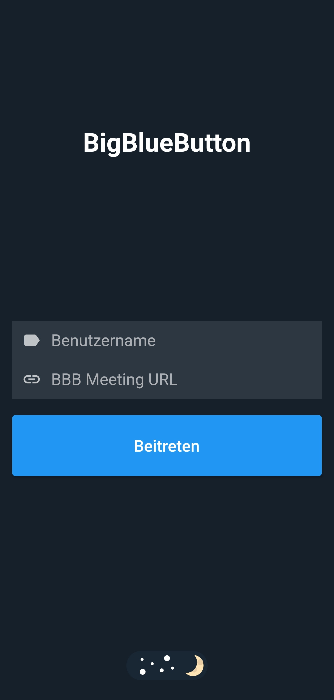
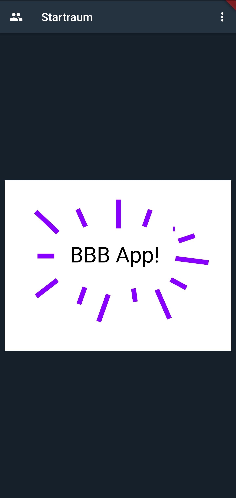
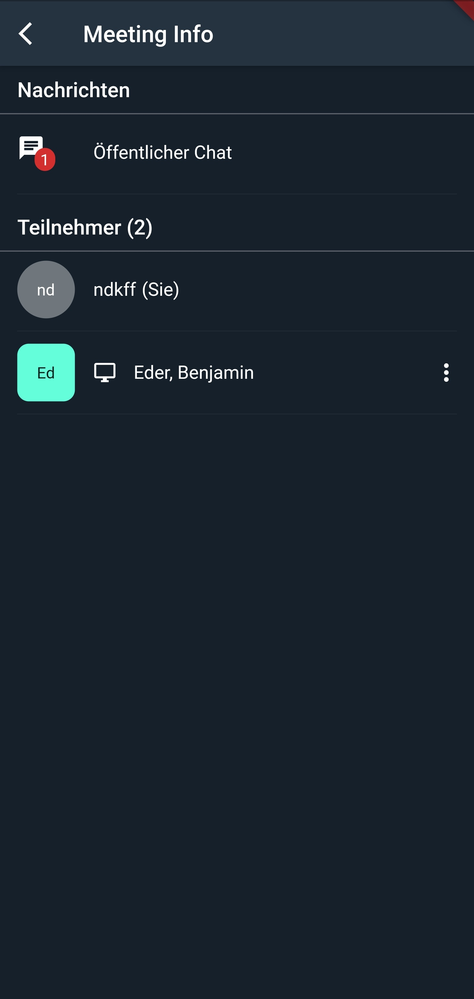
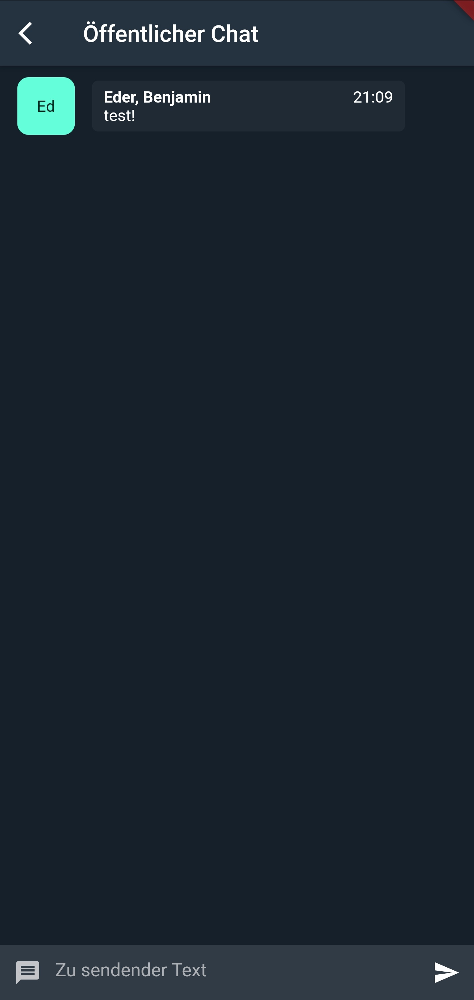

<p align="center">
    
</p>

<p align="center">
    Now available as early access version on <a href="https://play.google.com/store/apps/details?id=edu.hm.cs.tape.bbb_app">Google Play</a>.
</p>

<p align="center">
    Now available on <a href="https://apps.apple.com/de/app/bbb-app/id1548489267">App Store</a>.
</p>


# App client for BigBlueButton services

This app uses BigBlueButton and is not endorsed or certified by BigBlueButton Inc. BigBlueButton and the BigBlueButton Logo are trademarks of BigBlueButton Inc.

This project is a Flutter application.

## Getting Started

### Building and installing a release APK

Run `flutter build apk --release` followed by `flutter install` to build and install an APK on a connected Android device.

### How to test the app?

1. You need to have a BBB meeting session running.
Take a note of the **meeting URL**.

2. Open the app using the Emulator with Android Studio or build a release APK and install it to your device.

3. When the app opens up you should see the following start screen where you need to specify the BBB meeting URL, a username (arbitrary) and optionally an access code if the meeting is protected by one.

<p align="center">
    
</p>

4. You should see the main meeting view:

<p align="center">
    
</p>

### Developing

Follow the guide [here](https://flutter.dev/docs/get-started/) for instructions on how to install and use Flutter.

### Further screenshots

#### Meeting info view

<p align="center">
    
</p>

#### Chat view

<p align="center">
    
</p>


## Technical information

### Changing the app icon

When changing the application icon, you will need to run:

```
flutter pub run flutter_launcher_icons:main
```

which will update the necessary files for Android and iOS.
