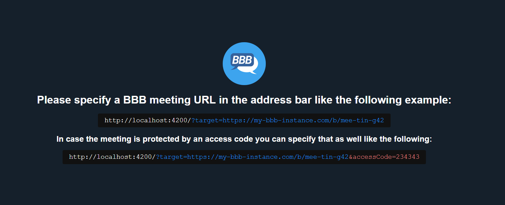
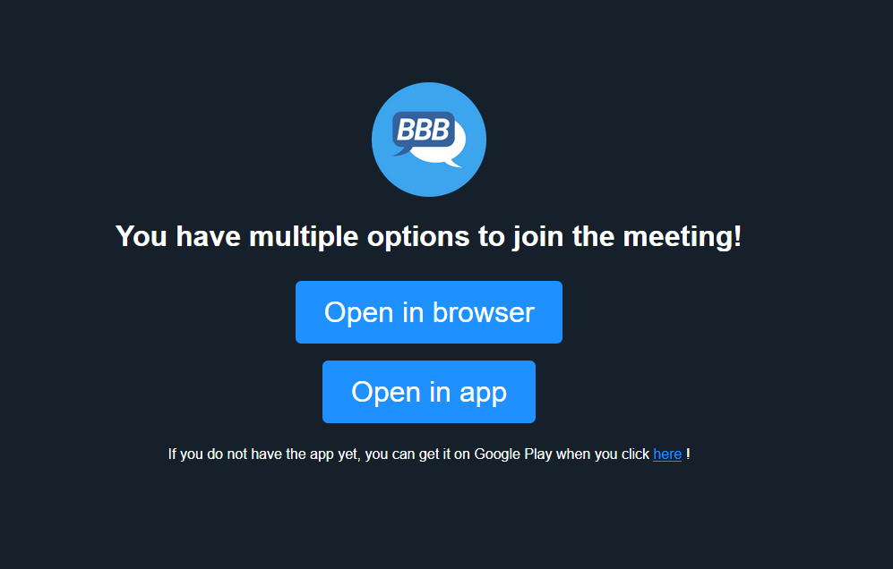

# Redirect web app

This web app is an example on how to start the BBB App from deep links.
The app supports deep links of the following format: `bbb-app://my-bbb-instance.com/b/mee-tin-g42?accessCode=233423`.
Note that the access code query parameter is optional for access code protected meetings.

You can now use this web app like the start page suggests:

If you send links of the suggested format to your users that point to this web application instead of the BBB meeting directly, they will be prompted with the following choice to either open the meeting in the browser or in the BBB app:

## Getting started

This app is an Angular app and thus can be developed using the Angular development server by calling `ng serve` on the terminal (You need to have Angular installed first, but check their documentation for instructions).

If you want to produce a production ready version in the `dist/redirect` folder under this folder, you will need to call `ng build --prod` from the terminal.
